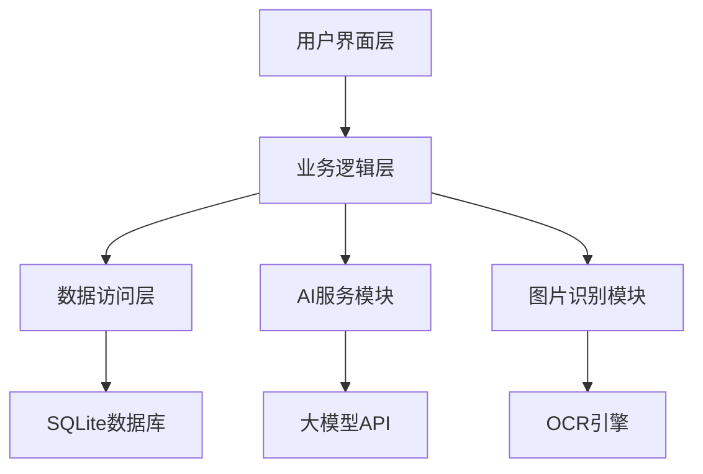
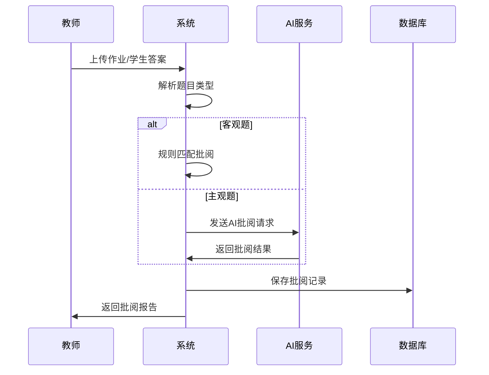

# 智能作业批阅平台 - 技术设计

## 概述

智能作业批阅平台是一个Windows桌面应用程序，使用C# WPF技术栈开发，支持多种题型的自动批阅、图片识别和AI智能批阅功能。

## 技术栈

| 技术 | 说明 |
|------|------|
| C# 12 | 编程语言 |
| .NET 8 | 运行时框架 |
| WPF | 用户界面框架 |
| SQLite | 本地数据库 |
| ML.NET | 机器学习模块 |
| IronPython | 脚本扩展支持 |
| WiX Toolset | 安装包制作 |

## 系统架构



## 项目结构

```
SmartGrader/
├── SmartGrader.Desktop/          # WPF主应用程序
│   ├── App.xaml
│   ├── MainWindow.xaml
│   ├── Views/                    # 页面视图
│   ├── ViewModels/               # 视图模型
│   ├── Converters/               # 数据转换器
│   └── Resources/                # 资源文件
├── SmartGrader.Core/             # 核心业务逻辑
│   ├── Models/                   # 数据模型
│   ├── Services/                 # 业务服务
│   ├── Interfaces/               # 接口定义
│   └── Helpers/                  # 工具类
├── SmartGrader.Data/             # 数据访问层
│   ├── Database/                 # 数据库配置
│   ├── Repositories/             # 数据仓库
│   └── Migrations/               # 数据迁移
├── SmartGrader.AI/               # AI服务模块
│   ├── Services/                 # AI服务
│   └── Models/                   # AI模型
├── SmartGrader.Image/            # 图片处理模块
│   ├── Services/                 # 图片服务
│   └── Converters/               # 格式转换
└── SmartGrader.Installer/        # 安装包项目
    └── Product.wxs               # WiX安装包配置
```

## 核心模块设计

### 1. 题库管理模块
- 支持多种题型: 选择题、填空题、判断题、简答题
- 题目编辑和导入导出功能
- 题目版本管理

### 2. 批阅引擎模块
- 规则批阅: 基于预设答案的规则匹配
- AI批阅: 调用AI模型进行智能评分
- 批阅结果记录和分析

### 3. 图片识别模块
- 支持图片上传和预览
- OCR文字识别
- 手写答案识别

### 4. 统计分析模块
- 班级成绩统计
- 题目正确率分析
- 批阅历史记录

## 数据模型

### 题目模型
```csharp
public class Question
{
    public int Id { get; set; }
    public string Title { get; set; }
    public string Type { get; set; } // 题型
    public string Content { get; set; }
    public List<Option> Options { get; set; }
    public string Answer { get; set; }
    public int Score { get; set; }
}

public class Option
{
    public string Label { get; set; }
    public string Content { get; set; }
}
```

### 作业模型
```csharp
public class Assignment
{
    public int Id { get; set; }
    public string Name { get; set; }
    public int TeacherId { get; set; }
    public List<Question> Questions { get; set; }
    public DateTime CreatedAt { get; set; }
}
```

### 批阅记录模型
```csharp
public class GradingRecord
{
    public int Id { get; set; }
    public int AssignmentId { get; set; }
    public int StudentId { get; set; }
    public string Answer { get; set; }
    public bool IsCorrect { get; set; }
    public int Score { get; set; }
    public string Feedback { get; set; }
    public DateTime GradedAt { get; set; }
}
```

## 关键流程

### 作业批阅流程


## 错误处理

- 网络异常: 自动重试，降级到本地批阅
- 图片识别失败: 提示重新上传或手动输入
- 数据库异常: 本地缓存，待恢复后同步

## 部署方案

使用WiX Toolset制作Windows安装包:
- 支持用户模式和机器模式安装
- 自动注册文件关联
- 支持一键升级和卸载
