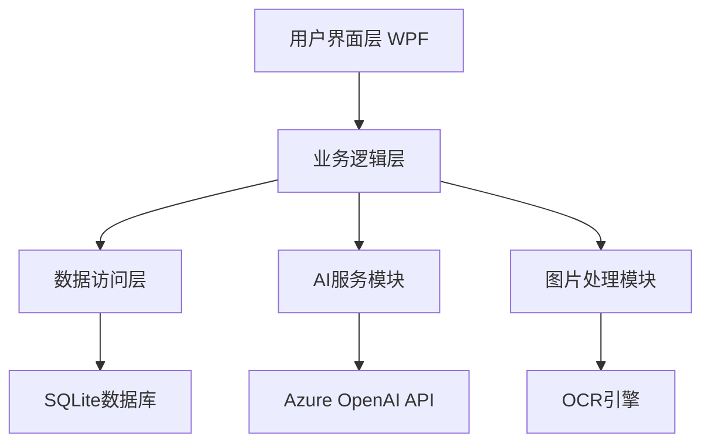

# 架构设计

## 系统概述

智能作业批阅平台采用分层架构设计，分为用户界面层、业务逻辑层、数据访问层和外部服务层。

## 技术栈

- **前端**: WPF (Windows Presentation Foundation)
- **后端**: .NET 8 / C# 12
- **数据库**: SQLite
- **AI服务**: Azure OpenAI API
- **图像处理**: SixLabors.ImageSharp + Tesseract OCR

## 项目结构

```
SmartGrader/
├── SmartGrader.Desktop/          # WPF主应用程序
│   ├── Views/                    # 页面视图
│   ├── ViewModels/               # 视图模型
│   ├── Converters/               # 数据转换器
│   └── Resources/                # 资源文件
├── SmartGrader.Core/             # 核心业务逻辑
│   ├── Models/                   # 数据模型
│   ├── Services/                 # 业务服务
│   └── Interfaces/               # 接口定义
├── SmartGrader.Data/             # 数据访问层
│   ├── Database/                 # 数据库配置
│   └── Repositories/             # 数据仓库
├── SmartGrader.AI/               # AI服务模块
│   └── Services/                 # AI服务
├── SmartGrader.Image/            # 图片处理模块
│   └── Services/                 # 图片服务
└── SmartGrader.Installer/        # 安装包项目
```

## 核心模块

### 1. 批阅引擎模块 (GradingEngine)
- 规则匹配批阅客观题
- 支持多种题型判断逻辑
- 生成批阅报告

### 2. AI服务模块 (AIService)
- 集成Azure OpenAI API
- 主观题智能批阅
- 自动生成评语

### 3. 图片处理模块 (ImageProcessingService)
- 图片格式转换和压缩
- OCR文字识别
- 手写内容提取

### 4. 数据访问层 (Repository)
- 基于Entity Framework Core
- SQLite本地存储
- 数据仓库模式

## 架构图



## 关键流程

### 作业批阅流程
1. 用户上传作业或输入学生答案
2. 系统识别题目类型
3. 客观题使用规则匹配
4. 主观题调用AI服务
5. 生成批阅结果和报告

## 设计决策

1. **选择WPF**: Windows原生体验，丰富的UI控件
2. **选择SQLite**: 无需安装数据库服务，便于分发
3. **分层架构**: 职责分离，便于维护和测试
