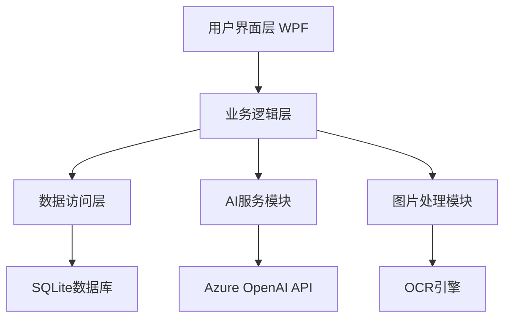

# 技术设计文档

## 功能名称: 智能作业批阅平台

更新日期: 2026-08-14

## 描述

智能作业批阅平台是一个Windows桌面应用程序，支持多种题型的自动批阅、图片识别和AI智能批阅。

## 架构

## 组件与接口

### IGradingEngine
- GradeAssignment: 批阅整个作业
- GradeQuestion: 批阅单个题目

### IAIgradingService
- GradeSubjectiveAsync: AI批阅主观题
- IsAvailableAsync: 检查AI服务可用性

### IImageProcessingService
- ProcessImageAsync: 处理图片
- ExtractTextAsync: 提取文字
- GetImageInfo: 获取图片信息

## 数据模型

### Question
- Id: 题目ID
- Title: 题目标题
- Type: 题型
- Content: 题目内容
- Options: 选项列表
- Answer: 标准答案
- Score: 分值

### Assignment
- Id: 作业ID
- Name: 作业名称
- Questions: 题目列表
- CreatedAt: 创建时间
- Deadline: 截止时间

### GradingRecord
- Id: 记录ID
- AssignmentId: 作业ID
- StudentId: 学生ID
- Answer: 学生答案
- IsCorrect: 是否正确
- Score: 得分
- Feedback: 评语

## 正确性属性

1. 批阅结果必须包含所有题目的批改
2. 客观题批阅必须准确匹配答案
3. AI批阅必须返回评分和评语
4. 图片识别必须支持常见格式

## 错误处理

- 网络异常: 降级到本地批阅
- 图片识别失败: 提示重新上传
- 数据库异常: 本地缓存，待恢复后同步
